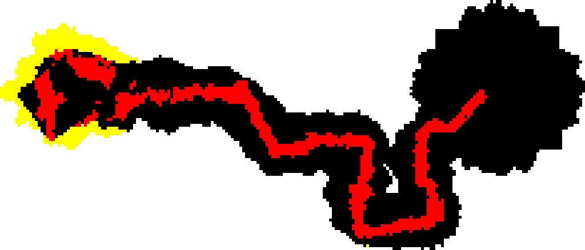
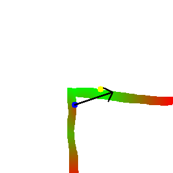

# Autonomous Underwater Vehicle (AUV) Control & Vision System

This repository contains the core software modules for our Autonomous Underwater Vehicle (AUV). The system is built around ROS 2 and is designed to handle complex underwater tasks including autonomous docking, 6-DOF motion control, and intelligent 2D pipe tracking. 

## Table of Contents
1. [System Overview](#system-overview)
2. [Docking System](#docking-system)
3. [Motion Controls](#motion-controls)
4. [2D Pipe Tracking Algorithm](#2d-pipe-tracking-algorithm)
5. [Future Work](#future-work)

---

## System Overview

Our AUV software stack is divided into highly specialized modules that work in tandem to execute autonomous missions. The architecture relies on visual inputs (ArUco markers, segmentation masks), telemetry (IMU, Barometer, DVL), and a robust control node that interfaces directly with the flight controller via MAVLink.

---

## Docking System

The docking module is designed to autonomously land the AUV on top of a designated underwater platform using ArUco marker arrays. It was developed referencing requirements from the TAC challenge.

### Workflow
1. **Detection & Alignment:** The camera feed detects the ArUco markers and calculates their geometric center. The AUV centers itself directly above this point.
2. **Short-Term Memory:** In the event of a visual detection failure (e.g., occlusion, lighting drop), a short-time memory system stores the last known position of the markers to maintain tracking continuity.
3. **Descent & Touchdown:** Once perfectly aligned on the X/Y axes, the AUV dives vertically until physical contact is made with the dock.
4. **Touch Verification:** While visual (TTC) and sonar methods can estimate the touchdown moment, the most robust verification method is monitoring the electrical connection between the dock and the AUV (hardware implementation outside the scope of this module).

---

## Motion Controls

The `motion_wp` module translates target waypoints and desired orientations into motor commands. It acts as the bridge between high-level navigation logic and low-level thruster execution.

### Inputs
The node subscribes to the `/trajectory/waypoint` topic, expecting a `Float32MultiArray` formatted as `[A, B, C]`:
* **A & B (X, Y Coordinates):** Represents the target position where the AUV's current position is `(0,0)`. Note: These coordinates are rotated according to the world frame using the IMU/magnetometer, ensuring absolute directional accuracy even if the input is relative.
* **C (Depth/Altitude):** Direct input from the barometer sensor. To position the AUV at depth `H`, input `C < 0` (where `H = -C`).
    * *Note:* Future implementations will allow `C > 0` to interface with a ping sonar, positioning the AUV relative to its distance from the seabed rather than the surface.

### Motion Modes
Controlled via the `/movement/mode` (String), `/aruco/angle` (Float), and `/movement/roll` (Bool) topics:
* **`yaw_centerize` (Default):** The AUV turns its nose (yaw) toward the target point before and during forward movement.
* **`no_centerize`:** The AUV translates (strafes) to the target point without altering its yaw. If an `aruco_angle` is provided, it will lock onto that specific orientation while translating.
* **`full_centerize`:** The AUV points both its yaw and pitch directly at the target, moving in a true 3D vector.
* **Rolling:** Executed asynchronously when the `isRolling` variable receives a "right" or "left" command.

### Troubleshooting Controls
The module outputs a `Twist` message to `/cmd_vel`, which the `cmd_vel_listener` translates for the Pixhawk.

* **Up-Down (Z-Axis):** If depth is incorrect, verify barometer sensor calibration (use QGroundControl or check `/mavros/global_position/rel_alt`).
* **Yaw Rotation:** If the angle is wrong, ensure you are sending radians (not degrees). If movement is unstable/oscillating, reduce the `yaw_tolerance` sensitivity.
* **Pitch & Roll Rotation:** If rolling the wrong way, check the `desired_roll` sign convention.
* **Arrival/Stopping:** If the AUV jitters or makes unstable movements upon reaching the target, increase the `dist_tolerance` to widen the "success" radius.

---

## 2D Pipe Tracking Algorithm

This module utilizes segmentation masks from our AI vision models to autonomously explore Points of Interest (POI) and map underwater pipelines.

### Main Algorithm (Coordinate-Based)
This mode utilizes DVL, compass headings, and barometer data to map pixel positions into physical world coordinates.
1. **Classification:** Pixels are classified based on their distance from the AUV:
    * *Close Proximity:* Classified strictly as `object` (mask > 0.5) or `not-an-object` (mask < 0.5).
    * *Far Proximity:* Tagged mask points are classified as `interested-points` (exploration targets).
2. **Smoothing:** Exponential smoothing is applied to previously classified pixels to prevent flickering and mapping noise.
3. **Navigation:** The closest `interested-point` is selected and sent to the movement algorithm. This loop continues until no interested points remain.
4. **Dynamic Mapping:** Points are saved to a 2D map that automatically resizes and adjusts its resolution based on the two farthest detected points.

### Scan Without Coordinates (Vision-Only)

In environments where DVL or IMU data is unreliable or unavailable, the system falls back to a purely vision-based dead-reckoning approach.

* **Weight Calculation:** Without a global map, the algorithm evaluates every tagged pixel in the current frame by assigning a weight ($W$):
  $$W = -W_1(d - d_c) - W_2(a)$$
  Where $a$ is the angle (0=Front, 3.14=Back), $d$ is distance, $d_c$ is the ideal focus distance, and $W_1, W_2$ are positive tuning floats.
* **Target Selection:** The pixel with the lowest weight ($W$) is chosen as the optimal immediate target and fed to the movement algorithm. Tuning $d_c$ and the weights allows us to adjust how early the AUV initiates turns along the pipe.

*Why not use bounding boxes?* Bounding boxes struggle significantly when the camera sees long, continuous sections of a pipeline or when dealing with partial, messy detections. Pixel-weighting is much more robust for continuous path following.

---

## Future Work
* **Simulation Diagnostics:** Integrate images and video logging to recognize and categorize error patterns in both simulations (HoloOcean) and real-world deployments.
* **Sensor Fusion:** Incorporate sonar-based detection systems to augment visual segmentation.
* **Efficiency Metrics:** Develop precision metrics to ensure minimum time and battery are spent during scanning operations.
* **Reinforcement Learning (RL):** Explore RL-based pathfinding methods and compare their real-world efficacy against our current deterministic simulation codes.
* **Vision Robustness:** Upgrade the vision-only scanner to analyze clusters of pixels rather than single pixels to reduce sensitivity to false-positive artifacts.